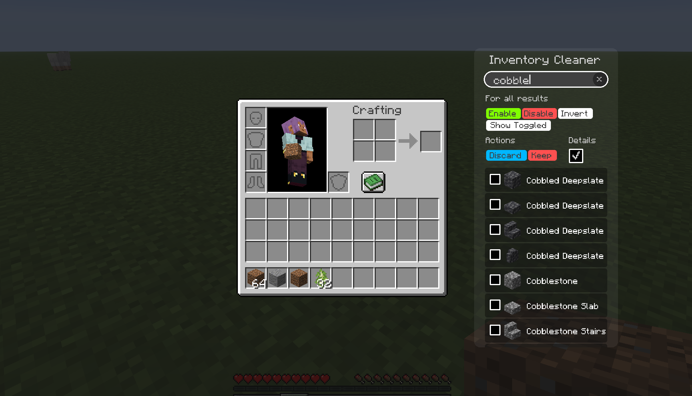
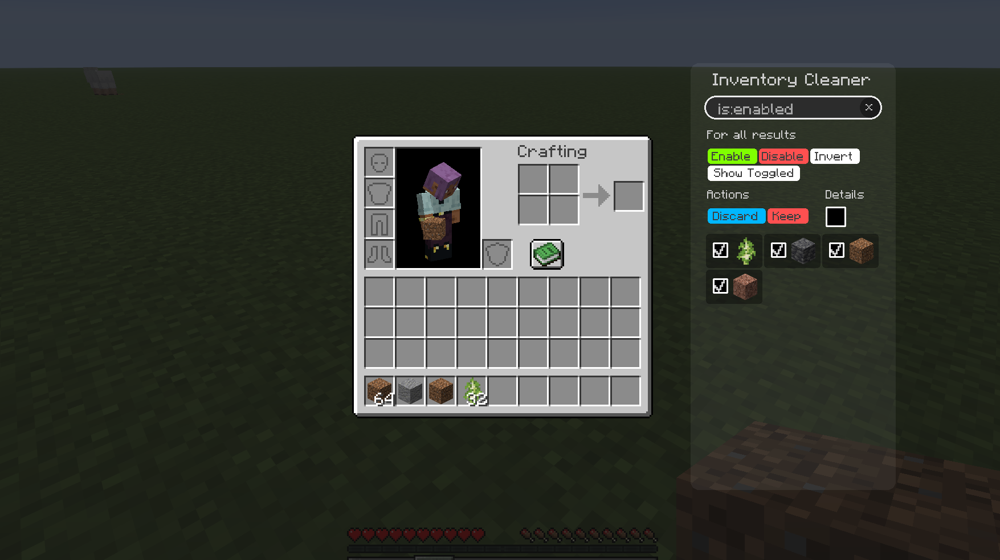
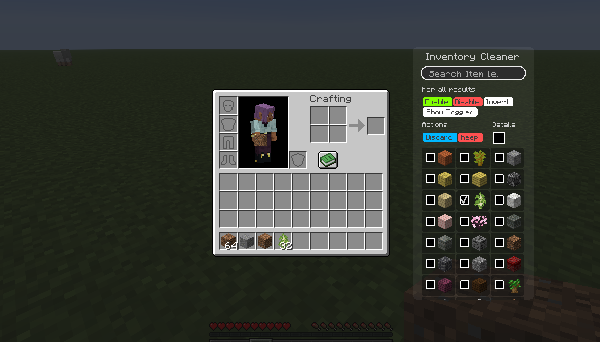

# Inventory Cleaner

---
Ever had items you wanted to discard build up in your inventory over time?
Dirt? Sand? Stone? Here's your solution!

***Disclaimers (2):***
- Since this mod works by sending inventory packets, servers may ban you for using it. Please check your server's rules before using this!
- No keybinding will be added for this, you have to manually click the blue or red buttons (so this doesn't turn into a macro)

This mod requires [**ImproperUI**](https://modrinth.com/mod/improperui) to run.


## Actions

| Action  | Description                               |
|:--------|:------------------------------------------|
| Discard | Drops all selected items from inventory   |
| Keep    | Drops all unselected items from inventory |


## Recent Changes
```yml
Version: 0.1.1

Changed:
  - background color to be more visible

Patches:
  - widgets still being clickable despite being hidden
```




<br>



<br>

